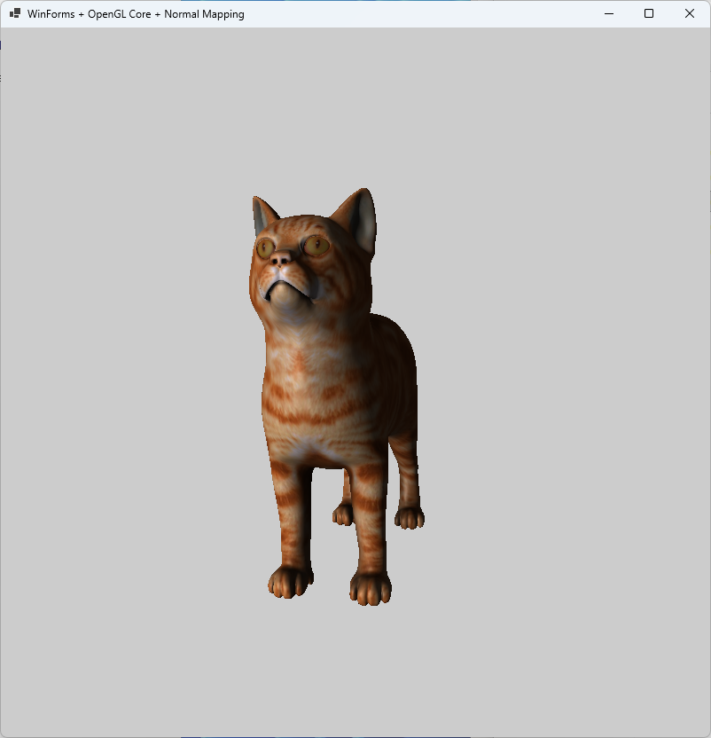

# CSharpCube / OBJ Viewer Demo

This is a small demonstration project written in **C# (WinForms)** using **pure OpenGL (via Win32 interop, no external libraries)**.
The goal of the project is to explore low-level graphics programming in .NET and implement a minimal but realistic rendering pipeline.

## Features
- OpenGL context creation without third-party wrappers
- Shader-based rendering (vertex + fragment shaders)
- Textured 3D rendering
- Basic camera controls (rotation, zoom)
- OBJ model loading (Wavefront format)
- Vertex buffer / VAO usage
- Depth testing

## Screenshot

## Technical Details
- Language: C#
- UI: WinForms
- Graphics API: OpenGL (Core Profile style usage where possible)
- Interop: Win32 (wgl, GDI)
- No external libraries (no OpenTK, no SharpGL, etc.)

## Controls
- Mouse drag — rotate camera
- Mouse wheel — zoom in/out

## Purpose
This project is not intended as a production-ready renderer.
It is a **learning / exploration project**, focused on:
- understanding how OpenGL works under the hood
- working without abstractions
- bridging managed (.NET) and unmanaged (OpenGL/Win32) worlds

## Notes
- The code intentionally avoids helper libraries to keep full control over the pipeline
- Some parts (like OBJ loading) are simplified and not fully spec-compliant
- Designed to be compact and readable rather than feature-complete

## How to Run
1. Open the solution in Visual Studio 2026
2. Build and run (x64 recommended)
3. Make sure your system supports OpenGL
